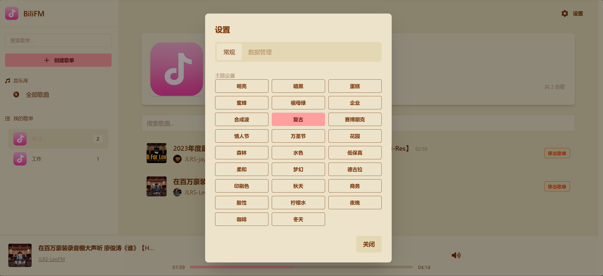

# BiliFM - B 站音乐播放器


BiliFM 是一款专为 B 站（Bilibili）用户设计的浏览器扩展，让您轻松收藏和管理喜爱的 B 站音乐内容。它提供了一个独立的音乐播放器界面，让您可以像使用音乐软件一样享受 B 站视频中的音频内容。

## 特色功能

- **专注音频**: 从 B 站视频中提取纯音频内容，减少流量消耗
- **创建歌单**: 将收藏的音频整理到自定义歌单中
- **离线播放**: 支持下载音频文件本地收听
- **右键收藏**: 浏览 B 站时可直接右键收藏当前视频为音频
- **多种播放模式**: 支持顺序播放、单曲循环、随机播放
- **倍速播放**: 支持自定义音频播放速度
- **界面美观**: 使用 DaisyUI 组件，支持多种主题切换

## 安装指南

目前该扩展尚未上架 Chrome 应用商店，您可以通过以下方式安装：

### 开发版安装

1. 克隆代码仓库

```bash
git clone https://github.com/IvanLark/BiliFM.git
```

2. 安装依赖

```bash
cd BiliFM
npm install
```

3. 运行项目

```bash
npm run dev
```

注意在运行项目时把`manifest.json`中的`action`设置为

```json
"action": {
   "default_icon": "public/icon.png"
}
```

4. 打包项目

```bash
npm run build
```

注意在打包时把`manifest.json`中的`action`设置为

```json
"action": {
   "default_icon": "public/icon.png",
   "default_popup": "index.html"
}
```

然后将打包结果`dist`中的`manifest.json`中的`action`设置为

```json
"action": {
   "default_icon": "public/icon.png"
}
```

5. 在 Chrome 浏览器中加载扩展
   - 打开 Chrome，访问 `chrome://extensions/`
   - 开启"开发者模式"
   - 点击"加载已解压的扩展程序"
   - 选择项目的`dist`文件夹

## 使用指南

### 界面截图

#### 视频页面收藏卡片


#### 右键菜单


#### 音乐播放器


#### 主题切换



### 基本使用

1. 在浏览 B 站视频页面时，点击右键菜单中的"收藏歌曲"或者在视频页面右侧的音乐收藏卡片中收藏音乐。
2. 点击扩展图标打开音乐播放器页面
3. 在播放器页面可以创建歌单、管理音频、控制播放
4. 在右上角设置页面，可以选择主题和导入导出数据

### 快捷键

- **空格键**: 播放/暂停当前音频

## 技术栈

- **React 19**: 用于构建用户界面
- **TypeScript**: 提供类型安全
- **TailwindCSS 4**: 提供响应式样式
- **DaisyUI 5**: 基于 TailwindCSS 的 UI 组件库
- **IndexedDB**: 存储用户数据和音频信息
- **Chrome Extension API**: 实现浏览器扩展功能
- **CRXJS**: 简化浏览器扩展开发
- **Vite**: 快速的开发服务器和构建工具

## 数据存储

BiliFM 使用浏览器的 IndexedDB 存储以下信息：

- 歌单信息
- 音频元数据（标题、作者、封面等）

用户数据存储在本地，不会上传到任何服务器。

## Road Map

- AI 工作流生成歌词

## 许可协议

本项目采用 MIT 许可证。

## 免责声明

BiliFM 仅供个人学习和研究使用。所有通过本扩展获取的音频内容版权归 B 站和原作者所有，请尊重版权，不要用于商业用途。

## 鸣谢

- [azusa-player](https://github.com/kenmingwang/azusa-player)
