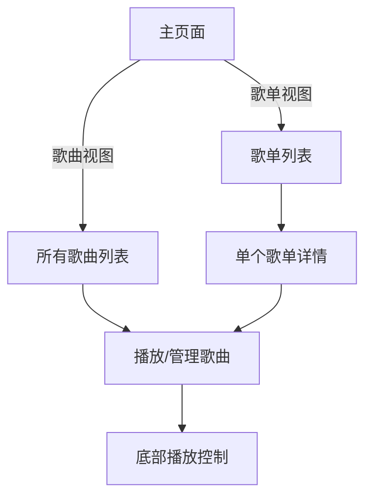

歌曲和歌单分开存储
主页面分别展示：

- 分页查看所有歌曲
- 查看所有歌单
  - 每个歌单点进去是歌单封面，歌单简介，以及歌单下的歌曲
    底部是播放器

```mermaid
graph TD
    A[主页面] -->|歌曲视图| B[所有歌曲列表]
    A -->|歌单视图| C[歌单列表]
    C --> D[单个歌单详情]
    B --> E[播放/管理歌曲]
    D --> E
    E --> F[底部播放控制]
```
